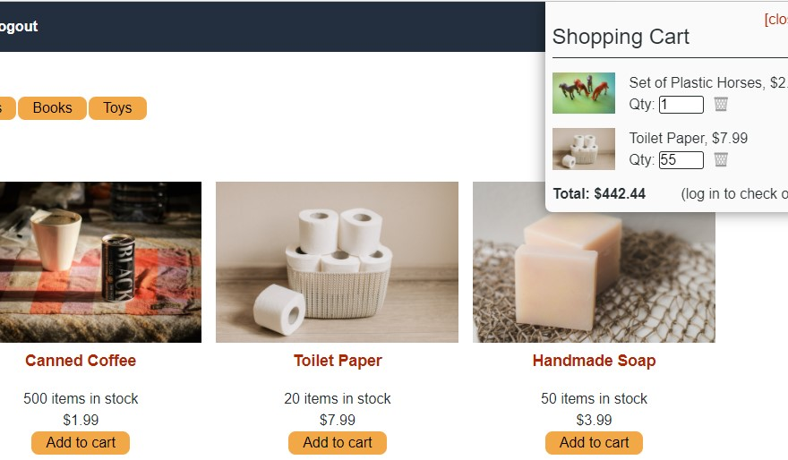

# Shop Shop Redux

  

  

  ## Description
  Shop Shop Redux is a simulated ecommerce application that allows a user to register with the application and then browse through the application's available products, adding and removing products to a virtual shopping cart.  When the user is ready to confirm purchase of the items in the shopping cart, the user is taken to a checkout page, where the user is able to add credit card information and complete the purchase.  (Again, this is a simulation, and the user should not enter real credit card information.)  Lastly, the user is able to access a record of his/her past orders through a link in the application.  This application is built using React and utilizes Redux to maintain global state.
  
  ## Link
  [Shop Shop Redux](https://stark-forest-79910.herokuapp.com/)
  
  ## Table of Contents
  
  * [Installation](#installation)
  * [Usage](#usage)
  * [License](#license)
  * [Contributing](#contributing)
  * [Tests](#tests)
  * [Questions](#questions)
  
  ## Installation
  
  To replicate this project, the user must have Node.js installed on her/his machine and then clone the files from this application's repository.  Once this is done, from the command line and in the root directory, the user can run the command 'npm run install'.  This should install all of the necessary Node packages.  If for some reason this command does not work, the user should individual go to both the client folder and the server folder and run the command 'npm install'.  This would install the necessary packages in each of the folder locations.
  
  ## Usage
  
  If cloning this program for local experimentation, once the installation steps mentioned earlier are completed, the user should run the command 'npm run develop' from the command line in the root directory.  The user should then navigate to http://localhost:3000 to begin experimenting with the application.  If the user wishes to use the deployed application, the user should use the link elsewhere in this file that leads directly to the site.
  
  ## License
  
  The content of this project is licensed under [The Unlicense](http://unlicense.org/).  Please click [here](http://unlicense.org/) for more information about how you may use code in this project.

  ## Contributing

  This application is basically complete and should not need any additional contributions to it.
  
  
  ## Tests
  
  There were no structured tests of components used for this application.  All testing done utilized the console.log directive when unexpected results arose.
  
  ## Questions
  [GitHub Profile](http://github.com/cabralwilliams)
  
  For any questions concerning this application, please contact me at cabral.williams@gmail.com.
